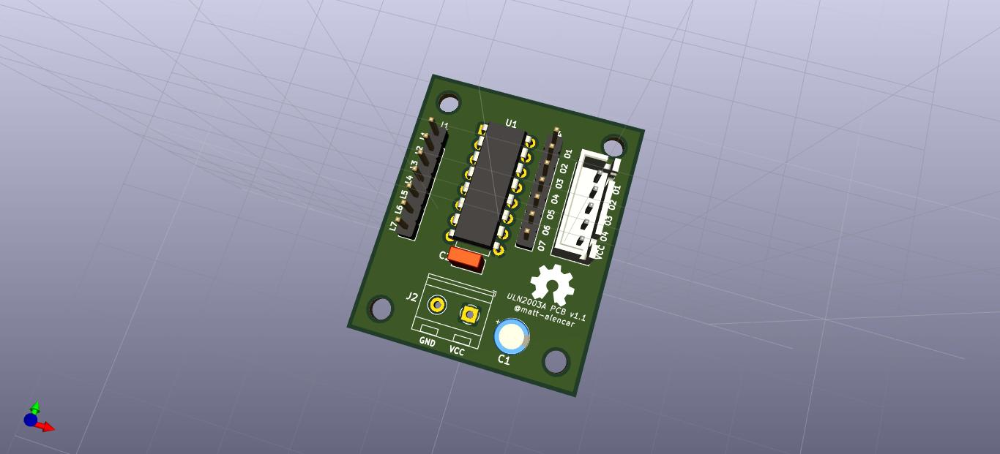

# Basic PCB based on ULN2003

Basic dual layer PCB project based on ULN2003 darlington transistor array, commonly used to drive unipolar stepper motor such as 28BYJ-48.

## Prerequisites

	Last version of KiCad software

## Versioning

	29/01/2019 - Initial work (V1.1)

## Authors

* **Matheus Alencar Nascimento** - *Initial work*

## License

This project is licensed under the MIT License - see the [LICENSE] file for details
